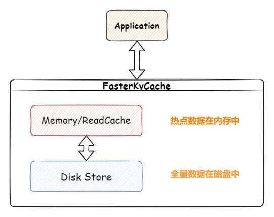

# FasterKv.Cache

FasterKv.Cache是一个基于微软FasterKv封装的进程内混合缓存库(内存+磁盘)。FasterKv它可以承载大于机器内存的Key-Value数据库，并且有着远超其它内存+磁盘数据库的性能。不过使用起来比较繁琐，对新人不友好，于是FasterKv.Cache在它的基础上进行了一层封装，让我们能更简单的处理缓存。



| 适用场景                                                     | 不适用场景                                   | 原因                                                         |
| ------------------------------------------------------------ | -------------------------------------------- | ------------------------------------------------------------ |
| 缓存数据量大，并且有降低内存使用的需求                       | 数据量小，或者有钞能力                       | 如果数据量小和有钞能力，直接使用内存缓存才是性能最好的。     |
| 有明显的冷、热数据，数据能存储在内存中                       | 没有冷热数据，完全随机访问                   | 如果完全随机访问，意味着内存缓存将无效，每次读盘损耗会比较大 |
| 对于缓存没有非常严格的延时要求，几百us无所谓                 | 对于缓存有高要求，不能接受波动               | 如果对于缓存有非常高的要求，几百微秒延时都不能忍受，那解决方案还是内存缓存 |
| 1.没有缓存非常大的数据。 2.有非常大的数据，但是经常访问，可以利用缓存。2.非常大的数据很少访问，对延时不敏感 | 有非常大的数据，且随机访问，并且延时非常敏感 | 如果有非常大的数据缓存，比如超过内存和ReadCache大小的，那么性能会变得比较差，想要解决它，只有钞能力。 |

笔者之前给EasyCaching提交了FasterKv的实现，但是由于有一些EasyCaching的高级功能在FasterKv上无法高性能的实现，所以单独创建了这个库，提供高性能和最基本的API实现；如果大家有使用EasyCaching那么一样可以直接使用EasyCaching.FasterKv。

## NuGet 软件包

| 软件包名                                                                                          | 版本        | 备注                                                                                        |
|-----------------------------------------------------------------------------------------------|-----------|-------------------------------------------------------------------------------------------|
| [FasterKv.Cache.Core](https://www.nuget.org/packages/FasterKv.Cache.Core)                     | 1.0.0-rc1 | 缓存核心包，包含FasterKvCache主要的API                                                               |
| [FasterKv.Cache.MessagePack](https://www.nuget.org/packages/FasterKv.Cache.MessagePack)       | 1.0.0-rc1 | 基于MessagePack的磁盘序列化包，它具有着非常好的性能，但是需要注意它稍微有一点使用门槛，大家可以看它的文档。                               |
| [FasterKv.Cache.SystemTextJson](https://www.nuget.org/packages/FasterKv.Cache.SystemTextJson) | 1.0.0-rc1 | 基于System.Text.Json的磁盘序列化包，它是.NET平台上性能最好JSON序列化封装，但是比MessagePack差。不过它易用性非常好，无需对缓存实体进行单独配置。 |

## 使用

### 直接使用

我们可以直接通过`new FasterKvCache(...)`的方式使用它，目前它只支持基本的三种操作`Get`、`Set`、`Delete`。为了方便使用和性能的考虑，我们将FasterKvCache分为两种API风格，一种是通用对象风格，一种是泛型风格。

* 通用对象：直接使用`new FasterKvCache(...)`创建，可以存放任意类型的Value。它底层使用`object`类型存储，所以内存缓冲内访问值类型对象会有装箱和拆箱的开销。
* 泛型：需要使用`new FasterKvCache<T>(...)`创建，只能存放`T`类型的Value。它底层使用`T`类型存储，所以内存缓冲内不会有任何开销。

当然如果内存缓冲不够，对应的Value被淘汰到磁盘上，那么同样都会有读磁盘、序列化和反序列化开销。

### 通用对象版本

代码如下所示，同一个cache实例可以添加任意类型：

```cs
using FasterKv.Cache.Core;
using FasterKv.Cache.Core.Configurations;
using FasterKv.Cache.MessagePack;

// create a FasterKvCache
var cache = new FasterKv.Cache.Core.FasterKvCache("MyCache",
    new DefaultSystemClock(),
    new FasterKvCacheOptions(),
    new IFasterKvCacheSerializer[]
    {
        new MessagePackFasterKvCacheSerializer
        {
            Name = "MyCache"
        }
    },
    null);

var key = Guid.NewGuid().ToString("N");

// sync 
// set key and value with expiry time
cache.Set(key, "my cache sync", TimeSpan.FromMinutes(5));

// get
var result = cache.Get<string>(key);
Console.WriteLine(result);

// get or add
result = cache.GetOrAdd(key, () => "my cache sync", TimeSpan.FromMinutes(5));
Console.WriteLine(result);

// delete
cache.Delete(key);

// async
// set
await cache.SetAsync(key, "my cache async");

// get
result = await cache.GetAsync<string>(key);
Console.WriteLine(result);

// get or add
result = await cache.GetOrAddAsync(key, () => "my cache async");
Console.WriteLine(result);

// delete
await cache.DeleteAsync(key);

// set other type object
cache.Set(key, new DateTime(2022,2,22));
Console.WriteLine(cache.Get<DateTime>(key));
```

输出结果如下所示：

```sh
my cache sync
my cache async
2022/2/22 0:00:00
```

### 泛型版本

泛型版本的话性能最好，但是它只允许添加一个类型，否则代码将编译不通过：

```cs
// create a FasterKvCache<T> 
// only set T type value
var cache = new FasterKvCache<string>("MyTCache",
    new DefaultSystemClock(),
    new FasterKvCacheOptions(),
    new IFasterKvCacheSerializer[]
    {
        new MessagePackFasterKvCacheSerializer
        {
            Name = "MyTCache"
        }
    },
    null);
```

### Microsoft.Extensions.DependencyInjection

当然，我们也可以直接使用依赖注入的方式使用它，用起来也非常简单。按照通用和泛型版本的区别，我们使用不同的扩展方法即可：

```cs
var services = new ServiceCollection();
// use AddFasterKvCache
services.AddFasterKvCache(options =>
{
    // use MessagePack serializer
    options.UseMessagePackSerializer();
}, "MyKvCache");

var provider = services.BuildServiceProvider();

// get instance do something
var cache = provider.GetService<FasterKvCache>();
```

泛型版本需要调用相应的`AddFasterKvCache<T>`方法：

```cs
var services = new ServiceCollection();
// use AddFasterKvCache<string>
services.AddFasterKvCache<string>(options =>
{
    // use MessagePack serializer
    options.UseMessagePackSerializer();
}, "MyKvCache");

var provider = services.BuildServiceProvider();

// get instance do something
var cache = provider.GetService<FasterKvCache<string>>();
```

## 配置

### FasterKvCache构造函数

```cs
public FasterKvCache(
    string name,											// 如果存在多个Cache实例，定义一个名称可以隔离序列化等配置和磁盘文件
    ISystemClock systemClock,								// 当前系统时钟，new DefaultSystemClock()即可
    FasterKvCacheOptions? options,							// FasterKvCache的详细配置，详情见下文
    IEnumerable<IFasterKvCacheSerializer>? serializers,		// 序列化器，可以直接使用MessagePack或SystemTextJson序列化器
    ILoggerFactory? loggerFactory)							// 日志工厂 用于记录FasterKv内部的一些日志信息
```

### FasterKvCacheOptions 配置项

对于FasterKvCache，有着和FasterKv差不多的配置项，更详细的信息大家可以看[FasterKv-Settings](https://microsoft.github.io/FASTER/docs/fasterkv-basics/#fasterkvsettings)，下方是FasterKvCache的配置：

* IndexCount：FasterKv会维护一个hash索引池，IndexCount就是这个索引池的hash槽数量，一个槽为64bit。需要配置为2的次方。如1024(2的10次方)、 2048(2的11次方)、65536(2的16次方) 、131072(2的17次方)。**默认槽数量为131072，占用1024kb的内存。**
* MemorySizeBit: FasterKv用来保存Log的内存字节数，配置为2的次方数。**默认为24，也就是2的24次方，使用16MB内存。**
* PageSizeBit：FasterKv内存页的大小，配置为2的次方数。**默认为20，也就是2的20次方，每页大小为1MB内存。**
* ReadCacheMemorySizeBit：FasterKv读缓存内存字节数，配置为2的次方数，缓存内的都是热点数据，最好设置为热点数据所占用的内存数量。**默认为20，也就是2的20次方，使用16MB内存。**
* ReadCachePageSizeBit：FasterKv读缓存内存页的大小，配置为2的次方数。**默认为20，也就是2的20次方，每页大小为1MB内存。**
* LogPath：FasterKv日志文件的目录，默认会创建两个日志文件，一个以`.log`结尾，一个以`obj.log`结尾，分别存放日志信息和Value序列化信息，如果开启了`DeleteFileOnClose`和`TryRecoverLatest`，也会创建一个`.checkpoint`来进行故障恢复，**注意，不要让不同的FasterKvCache使用相同的日志文件，会出现不可预料异常**。**默认为`{当前目录}/FasterKvCache/{进程Id}-HLog/{实例名称}.log`**。
* SerializerName：Value序列化器名称，需要安装序列化Nuget包，如果没有单独指定`Name`的情况下，可以使用`MessagePack`和`SystemTextJson`。**默认无需指定**。
* PreallocateFile: 是否预分配日志文件，如果开启，那么在创建日志文件的时候会预分配指定1GB大小的文件，如果有大量数据的话，预分配能提升性能。**默认为false**。
* DeleteFileOnClose: 是否在关闭的时候删除日志文件，如果开启，那么在关闭的时候会删除日志文件，如果不开启，那么会保留日志文件，下次启动的时候会继续使用。**默认为true**。
* TryRecoverLatest: 是否在启动的时候尝试恢复最新的日志文件，如果开启，那么在启动的时候会尝试恢复最新的日志文件，如果不开启，那么会重新开始，如果要使它生效，需关闭`DeleteFileOnClose`。**默认为false**。
* ExpiryKeyScanInterval：由于FasterKv不支持过期删除功能，所以目前的实现是会定期扫描所有的key，将过期的key删除。这里配置的就是扫描间隔。**默认为5分钟**。
* CustomStore：如果您不想使用自动生成的实例，那么可以自定义的FasterKv实例。**默认为null**。

所以FasterKvCache所占用的内存数量基本就是`(IndexCount*64)+(MemorySize)+ReadCacheMemorySize`，当然如果Key的数量过多，那么还有加上`OverflowBucketCount * 64`。

## 容量规划

从上面提到的内容大家可以知道，FasterKvCache所占用的内存**字节**基本就是`(IndexCount * 64)+(MemorySize) + ReadCacheMemorySize + (OverflowBucketCount * 64)`。磁盘的话就是保存了所有的数据+对象序列化的数据，由于不同的序列化协议有不同的大小，大家可以先进行测试。

内存数据存储到FasterKv存储引擎，每个key都会额外元数据信息，存储空间占用会有一定的放大，建议在磁盘空间选择上，留有适当余量，按实际存储需求的 1.2 - 1.5倍预估。

如果使用内存存储 100GB 的数据，总的访问QPS不到2W，其中80%的数据都很少访问到。那么可以使用 【32GB内存 + 128GB磁盘】 存储，节省了近 70GB 的内存存储，内存成本可以下降50%+。

## 性能

目前作者还没有时间将FasterKvCache和其它主流的缓存库进行比对，现在只对FasterKvCache、EasyCaching.FasterKv和EasyCaching.Sqlite做的比较。下面是FasterKVCache的配置，总内存占用约为**2MB**。

```cs
services.AddFasterKvCache<string>(options =>
{
    options.IndexCount = 1024;
    options.MemorySizeBit = 20;
    options.PageSizeBit = 20;
    options.ReadCacheMemorySizeBit = 20;
    options.ReadCachePageSizeBit = 20;
    // use MessagePack serializer
    options.UseMessagePackSerializer();
}, "MyKvCache");
```

由于作者笔记本性能不够，使用Sqlite无法在短期内完成100W、1W个Key的性能测试，所以我们在默认设置下将数据集大小设置为1000个Key，设置50%的热点Key。进行100%读、100%写和50%读写随机比较。

可以看到无论是读、写还是混合操作FasterKvCache都有着不俗的性能，在8个线程情况下，TPS达到了**惊人的1600w/s**。

| Provider      | Type   | ThreadNum | Mean(us)   | Error(us)  | StdDev(us) | Gen0    | Gen1   | Allocated  |
| ------------- | ------ | --------- | ---------- | ---------- | ---------- | ------- | ------ | ---------- |
| fasterKvCache | Read   | 8         | 59.95      | 3.854      | 2.549      | 1.5259  | 7.02   | NULL       |
| fasterKvCache | Write  | 8         | 63.67      | 1.032      | 0.683      | 0.7935  | 3.63   | NULL       |
| fasterKvCache | Random | 4         | 64.42      | 1.392      | 0.921      | 1.709   | 8.38   | NULL       |
| fasterKvCache | Read   | 4         | 64.67      | 0.628      | 0.374      | 2.5635  | 11.77  | NULL       |
| fasterKvCache | Random | 8         | 64.80      | 3.639      | 2.166      | 1.0986  | 5.33   | NULL       |
| fasterKvCache | Write  | 4         | 65.57      | 3.45       | 2.053      | 0.9766  | 4.93   | NULL       |
| fasterKv      | Read   | 8         | 92.15      | 10.678     | 7.063      | 5.7373  | -      | 26.42 KB   |
| fasterKv      | Write  | 4         | 99.49      | 2          | 1.046      | 10.7422 | -      | 49.84 KB   |
| fasterKv      | Write  | 8         | 108.50     | 5.228      | 3.111      | 5.6152  | -      | 25.93 KB   |
| fasterKv      | Read   | 4         | 109.37     | 1.476      | 0.772      | 10.9863 | -      | 50.82 KB   |
| fasterKv      | Random | 8         | 119.94     | 14.175     | 9.376      | 5.7373  | -      | 26.18 KB   |
| fasterKv      | Random | 4         | 124.31     | 6.191      | 4.095      | 10.7422 | -      | 50.34 KB   |
| fasterKvCache | Read   | 1         | 207.77     | 3.307      | 1.73       | 9.2773  | 43.48  | NULL       |
| fasterKvCache | Random | 1         | 208.71     | 1.832      | 0.958      | 6.3477  | 29.8   | NULL       |
| fasterKvCache | Write  | 1         | 211.26     | 1.557      | 1.03       | 3.418   | 16.13  | NULL       |
| fasterKv      | Write  | 1         | 378.60     | 17.755     | 11.744     | 42.4805 | -      | 195.8 KB   |
| fasterKv      | Read   | 1         | 404.57     | 17.477     | 11.56      | 43.457  | -      | 199.7 KB   |
| fasterKv      | Random | 1         | 441.22     | 14.107     | 9.331      | 42.9688 | -      | 197.75 KB  |
| sqlite        | Read   | 8         | 7450.11    | 260.279    | 172.158    | 54.6875 | 7.8125 | 357.78 KB  |
| sqlite        | Read   | 4         | 14309.94   | 289.113    | 172.047    | 109.375 | 15.625 | 718.9 KB   |
| sqlite        | Read   | 1         | 56973.53   | 1,774.35   | 1,173.62   | 400     | 100    | 2872.18 KB |
| sqlite        | Random | 8         | 475535.01  | 214,015.71 | 141,558.14 | -       | -      | 395.15 KB  |
| sqlite        | Random | 4         | 1023524.87 | 97,993.19  | 64,816.43  | -       | -      | 762.46 KB  |
| sqlite        | Write  | 8         | 1153950.84 | 48,271.47  | 28,725.58  | -       | -      | 433.7 KB   |
| sqlite        | Write  | 4         | 2250382.93 | 110,262.72 | 72,931.96  | -       | -      | 867.7 KB   |
| sqlite        | Write  | 1         | 4200783.08 | 43,941.69  | 29,064.71  | -       | -      | 3462.89 KB |
| sqlite        | Random | 1         | 5383716.10 | 195,085.96 | 129,037.28 | -       | -      | 2692.09 KB |

## 其它

由于现在还只是1.0.0-rc1版本，还有很多特性没有实现。可能有一些BUG还存在，欢迎大家试用和反馈问题。
